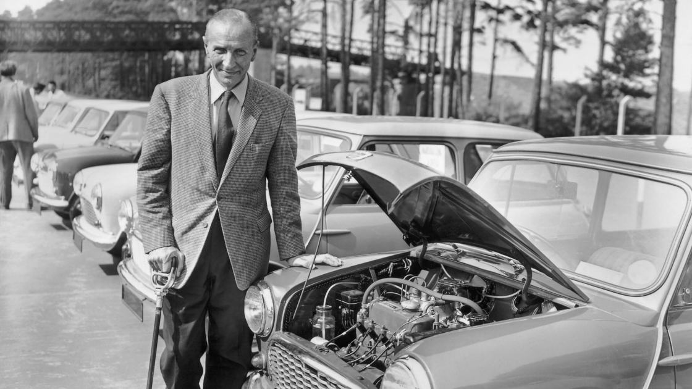
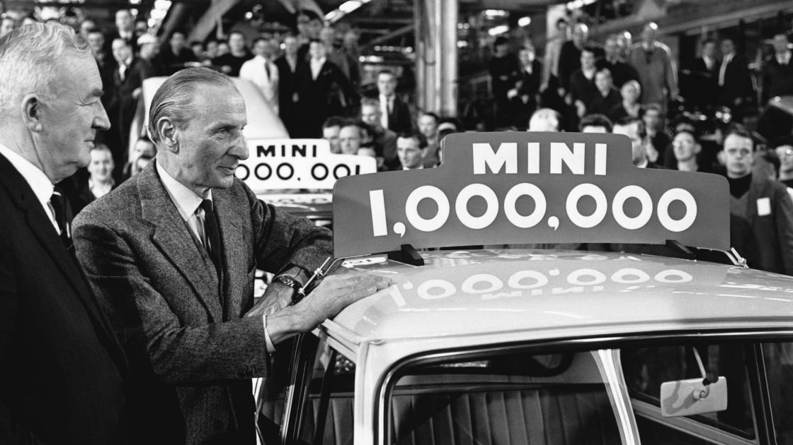
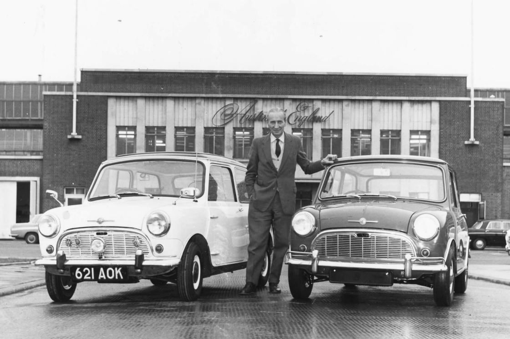

# Mini - бренд

## REINVENTING URBAN LIFE - THE MINI WAY.

MINI energises peoples’ lives with maximal experiences and a minimal footprint. Small in size and iconic in design, the first Mini, built in 1959, delivered a thrill all its own. Today, MINI is applying these ideas across urban life.

[The MINI Heritage.](https://www.mini.com/en_MS/home/automotive/heritage.html)

[MINI. История.](https://history.mini.ru/)

# Создатель культовой машины: Алек Иссигонис

Взгляд в жизнь основателя Mini.

THE CREATOR OF AN ICONIC CAR: ALEC ISSIGONIS.

A GLIMPSE INTO THE LIFE OF THE MINI FOUNDER.

Инновационная. Уникальная. Культовая. Mini произвела сенсацию своим дизайном и компактными размерами в конце 1950ых благодаря своему создателю - англичанину Алеку Иссигонису. Путь к этой точке был не прост. Но его история лишний раз доказывает: никогда не бросай своей мечты, даже если жизнь ставит преграды на пути.

Innovative. Unique. Iconic. The Mini caused a sensation with its design and rather small size in the late 1950s thanks to its inventor, the Englishman Alec Issigonis. To get to this point wasn’t easy. However, his story proves: never give up your dreams even if life puts obstacles in your way.

Алек Иссигонис (Сэр Александр Арнольд Константин Иссигонис) родился в Смирне в Османской Империи. Сейчас это Измир, Турция. Его отец был успешным и богатым инженером-судостроителем с греческими корнями и британским паспортом. Его мать была из Баварии. В 1922 семья покинула Турцию и отправилась в Британию, так как все британцы были изгнаны из страны. Но отец Алека не пережил путешествие.

Иссигонис мечтал стать инженером автомобилей с ранних лет. В 1925-1928 он изучал машиностроение в Политехническом институте Баттерси в Лондоне. Он преуспел в инженерной графике, но трижды проваливал экзамены по математике. Он получил диплом, но не был допущен к продолжению обучения в магистратуре.

В 1928 он получил первую работу в конструкторском бюро Gillett - инженерной компании в Лондоне. В 1934 Иссигониса пригласили на работу в конструкторское Бюро в Humber Ltd в Ковентри. Тогда он начал работу над специальным спринтерским автомобилем с другом.

Alec Issigonis (Sir Alexander Arnold Constantine Issigonis) was born in Smyrna in the Ottoman Empire (now Izmir, Turkey). His father, a successful and wealthy shipbuilding engineer, was of Greek origin but held a British passport. His mother was from Bavaria. In 1922 the family left Turkey for England, as all British people were banished from the country. His father, however, did not survive the crossing.

Issigonis had the dream of becoming an automobile engineer at an early age. From 1925-1928 he studied engineering at Battersea Polytechnic in London. He excelled in mechanical drawing, but failed his mathematics exams three times. He managed to obtain his Diploma, but was not admitted to advanced studies.

In 1928 his first job was in the design office of Gillett, an engineering firm in London. In 1934 Issigonis was invited to join the drawing office at Humber Ltd in Coventry. During this time he started to build a special sprint racer with a friend.  

В свои 30 он работал в инженерном департаменте Morris и праздновал свой первый успех с построением Morris Minor. Когда Morris и Austin слиялись для образования British Motor Corporation в 1952, Иссигонис покинул компанию. Он ушёл в Avis, где работал над роскошным салоном, но проект свернули из-за экономических соображений. Тогда Иссигонис вернулся в British Motor Corporation, где влияние политических факторов подтолкнуло его к большому прорыву.

At the age of 30 he worked for the Morris Engineering Department and celebrated his first success with the construction of the Morris Minor. When Morris and Austin merged to form the British Motor Corporation in 1952, Issigonis decided to leave the company. He then moved on to Avis, where he worked on the development of a luxury saloon, but the project had to be discontinued for cost reasons. Issigonis then went back to the British Motor Coperation, where the influence of many political factors lead him to his major breakthrough.

### Нефтяной кризис зажигает идею.

THE OIL CRISIS SPARKED THE IDEA.

Во время Второй мировой войны, Великобритания владела Суэцким каналом, который был важным источником нефти. Но этому пришёл конец во время Суэцкого кризиса в 1956. Потеря Британией территории привело не только к политическому поражению, но и к нефтяному кризису.

During the Second World War, Britain was in control of the Suez Canal, which served as an important source of oil, but this changed during the so called Suez crisis in 1956. The loss of British sovereignty led not only to a political defeat but also to an oil crisis.

Для Алека Иссигониса это стало шансом показать себя. Задача - автомобиль с большим пространством внутри и минимальными размерами снаружи, четырёхместный, безупречные ходовые качества, высшая экономия бензина и крайне доступная цена. Именно это он и сделал. Результатом стало большее, чем создание доступного автомобиля.

For Alec Issigonis it was THE chance to prove himself. The task: a car with lots of space inside with minimum dimensions outside, seats for four passengers, impeccable driving characteristics, superior fuel economy, and a very affordable price. That's exactly what he did. And the result was the creation of more than just an economical car.

Mini быстро стала культом и получила фанатов по всей планете. Годы спустя, несмотря на огромное дальнейшее развитие, автомобиль не потерял исходного очарования. Что же Алек Иссигонис? Он вошёл на страницы истории как основатель Mini и был посвящён в рыцари за свои заслуги.

The Mini quickly became cult and had enthusiastic fans worldwide. Decades later, despite enormous further developments, the vehicle has lost none of its initial charm. And Alec Issigonis? Well, he went down in history as the father of the Mini and was even raised to nobility for his services.

[The creator of an iconic car: Alec Issigonis. (mini.com)](https://www.mini.com/en_MS/home/automotive/heritage/the-creator-of-an-iconic-car-alec-issigonis.html)