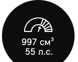

MINI: элегантность в минимуме пространства

История автомобиля, который был нарисован на салфетке и стал легендой.

### Создатель культового автомобиля

Алек Иссигонис (Сэр Александр Арнольд Константин Иссигонис) родился в Смирне в Османской Империи. Сейчас это Измир, Турция. Его отец был успешным и богатым инженером-судостроителем с греческими корнями и британским паспортом. Его мать была из Баварии. В 1922 семья покинула Турцию и отправилась в Британию, так как все британцы были изгнаны из страны. Но отец Алека не пережил путешествие.

Иссигонис мечтал стать инженером автомобилей с ранних лет. В 1925-1928 он изучал машиностроение в Политехническом институте Баттерси в Лондоне. Он преуспел в инженерной графике, но трижды проваливал экзамены по математике. Он получил диплом, но не был допущен к продолжению обучения в магистратуре.

В 1928 он получил первую работу в конструкторском бюро Gillett - инженерной компании в Лондоне. В 1934 Иссигониса пригласили на работу в конструкторское Бюро в Humber Ltd в Ковентри. Тогда он начал работу над специальным спринтерским автомобилем с другом.

В свои 30 он работал в инженерном департаменте Morris и праздновал свой первый успех с построением Morris Minor. Когда Morris и Austin слиялись для образования British Motor Corporation в 1952, Иссигонис покинул компанию. Он ушёл в Avis, где работал над роскошным салоном, но проект свернули из-за экономических соображений. Тогда Иссигонис вернулся в British Motor Corporation, где влияние политических факторов подтолкнуло его к большому прорыву.

## 1957

Во время Второй мировой войны, Великобритания владела Суэцким каналом, который был важным источником нефти. Но этому пришёл конец во время Суэцкого кризиса в 1956. Потеря Британией территории привело не только к политическому поражению, но и к нефтяному кризису.

Для Алека Иссигониса это стало шансом показать себя. Задача - автомобиль с большим пространством внутри и минимальными размерами снаружи, четырёхместный, безупречные ходовые качества, высшая экономия бензина и крайне доступная цена. Именно это он и сделал. Результатом стало большее, чем создание доступного автомобиля.

В конце 50-х эра огромных автомобилей, ездивших от заправки до заправки, подошла к концу — им на смену приходят продуманные в каждой детали и эффективные автомобили.

Алек Иссигонис ставит перед собой задачу создать миниатюрный и экономичный автомобиль, который с комфортом может вместить 4 взрослых человек и багаж. Максимально эффективно использовать пространство позволила инновационная идея: четырехцилиндровый двигатель расположили поперечно над коробкой передач — в результате салон занимает 80% площади автомобиля.

> — Самый простой способ победить — сделать автомобиль, настолько отличный от всех остальных, что он автоматически станет легендарным.
>
> Алек Иссигонис
>
> Создатель MINI

## 1959

С момента создания первого эскиза прошло два года. 26 августа 1959 года в более чем ста странах мира одновременно встречают Mini — тот самый автомобиль, на котором совсем скоро будут ездить гонщики, рок-звезды, актеры, спортсмены и просто ценители стиля и мощности.

В процессе работы над новым автомобилем сэр Иссигонис уделял особое внимание эргономике салона, управляемости, безопасности и эффективности расходования топлива. Каждое инженерное решение в новом автомобиле служило одной из этих задач — ни одна технология, даже самая современная, не нужна сама по себе, считал конструктор.

Внести последние штрихи в дизайн нового автомобиля Алеку Иссигонису помогали дизайнеры Pininfarina — легендарной итальянской студии автомобильного дизайна.

Mini быстро стала культом и получила фанатов по всей планете. Годы спустя, несмотря на огромное дальнейшее развитие, автомобиль не потерял исходного очарования. Что же Алек Иссигонис? Он вошёл на страницы истории как основатель Mini и был посвящён в рыцари за свои заслуги.

## Вопросы

1. В каком городе получил университетское образование сэр Алек Иссигонис?
   1. Смирна
   2. Париж
   3. Лондон (верный)
   4. Москва
2. Что стало причиной дефицита топлива после 1956 года?
   1. Рост экономики США
   2. Суэцкий кризис (верно)
   3. Послевоенная депрессия
   4. Мода на экономию
3. В каком году был нарисован эскиз первого Mini?
   1. 1961
   2. 1956
   3. 1957 (верно)
   4. 1959
4. Сколько человек мог вместить первый Mini?
   1. 1
   2. 2
   3. 3
   4. 4 (верно)
5. Дизайнеры какой компании помогли Иссигонису с дизайном автомобиля?
   1. Pininfarina (верно)
   2. Ferrari
   3. Italdesign Giugiaro
   4. BMW

## 1961

В 1961 году с Mini знакомится Джон Купер, известный британский гонщик и конструктор команды Формулы 1. Он решает, что именно на этой небольшой и практичной машине выиграет самые сложные гонки того времени. Для этого Купер снабжает его мощным двигателем, дисковыми тормозами и более резким рулевым управлением.

Так появляется легендарный Mini Cooper 997 с двигателем 55 л.с.

Стильные автомобили буквально наводнили Лондон. Mini не только гоночный — в первую очередь это удобный городской автомобиль, владелец которого может не беспокоиться о парковочном месте.

Чтобы разместить в небольшом автомобиле больше багажа, дверцу багажника можно открыть — и откидная табличка с номером останется вертикальной.

.jpg)

Алек Иссигонис и Джон Купер

Стилист The Rolling Stones, модельер Мэри Куант, одна из создательниц уличной моды 60-х, призналась, что идея мини-юбок — а в то время они были действительно крошечными — пришла ей благодаря Mini.

## 1963

В погоне за самым совершенным спортивным Mini к Джону Куперу присоединяется сэр Иссигонис. Так выходит в свет Mini Cooper S 1071 c мотором большего объёма и мощности (1071 куб.см, 70 л.с.).

С тех пор для Mini не существует ничего невозможного. Мечта Джона Купера оправдывается — в 1964 году его команда выигрывает в ралли «Монте-Карло».

Пилоты Mini Cooper быстрее всех проходят наисложнейший маршрут по серпантинам и побережью Монако и юга Франции, произведя настоящий фурор: компактный британский автомобиль впервые побеждает в такой крупной гонке.

После этого Mini сохраняет первенство еще в 1965 и 1967 годах.

## Вопросы

1. Каков был объем двигателя Mini Cooper 997?
   1. 1071 кубический сантиметр
   2. 50 л.с.
   3. 991 кубический сантиметр.
   4. 997 кубических сантиметров (верно)
2. Каков был объем двигателя Mini Cooper S 1071?
   1. 1071 кубический сантиметр (верно)
   2. 997 кубических сантиметров
   3. 50 л.с.
   4. 991 кубический сантиметр.
3. Сколько лошадиных сил было в Mini Cooper 997?
   1. 50 л.с. (верно)
   2. 35 л.с.
   3. 70 л.с.
   4. 55 л.с.
4. Сколько лошадиных сил было в Mini Cooper S 1071?
   1. 50 л.с.
   2. 35 л.с.
   3. 70 л.с. (верно)
   4. 55 л.с.
5. В каком году вышел Mini Cooper S 1071?
   1. 1961
   2. 1963 (верно)
   3. 1957
   4. 1965
6. В каком ралли впервые побеждает команда Mini?
   1. Ралли Монако
   2. Ралли Монте-Карло (верно)
   3. Дакар
   4. Формула 1
7. В какой стране проходит ралли Монте-Карло?
   1. Италия
   2. Франция (верно)
   3. Великобритания
   4. Монако (верно)

## 1969

Первоначально Mini продавались под названиями Austin Seven и Morris Mini Minor, но сейчас эти названия помнят только настоящие ценители.

В 1969 году появляются три новых модели: Mini Clubman, Mini Clubman Estate и Mini 1275 GT — теперь в линейке есть и автомобили для профессионального спорта, и Mini «повышенной вместимости».

Автомобиль становится символом эпохи. В мире продано уже 2 миллиона Mini. Юбилейный автомобиль сходит с конвейера 19 июня 1969 года.

> Двери первых моделей Mini имели сдвижные окна, a в незанятой полости нижней половины двери разместили карман. По одной из легенд (а у легендарного автомобиля их немало), его размеры были рассчитаны таким образом, чтобы туда помещалась классическая английская «зелёная» бутылка джина Gordon’s Gin.

В этом же году автомобиль становится звездой кинематографа, снявшись в фильме «Ограбление по-итальянски». Режиссер фильма, британец Питер Коллинсон, выбрал в качестве героя фильма Mini как символ обновленной Британии, «веселой и уверенной в себе». Кстати, все автомобили были приобретены по рыночной цене.

.jpg)

.jpg)

Mini стал культовым. На нем ездят члены королевской семьи, Beatles, Шарль Азнавур, Жан-Поль Бельмондо, а в гараже Энцо Феррари было целых три Mini.

## 1976

В этом году представлена первая в истории специальная версия Mini Limited Edition 1000.

Специальные и лимитированные версии отличались от базовых внешним видом и отделкой. Однако, иногда они включали и технические улучшения.

> Знаменитые специальные серии MINI
>
> Mini Limited Edition 1000
> Mini 25
> Mini Ritz
> Mini Chelsea
> Mini Piccadilly
> Mini Park Lane
> Mini Thirty
> Mini 35
> Mini 40
> Mini Park Lane
> Mini Checkmate
> Seven

Лимитированные серии и возможность персонализации автомобиля сделали Mini иконой стиля.

Благодаря этому Mini стали очень популярны, например, в Японии. Количество продаваемых там автомобилей превышало показатели любой другой марки Rover Group.

## 1986

В 1986 году с конвейера сходит пятимиллионный автомобиль, делая тем самым Mini самой продаваемой британской маркой в мире.

В этом же году увидели свет специальные версии Mini Chelsea и Mini Piccadilly, а годом позже легендарная Mini Park Lane с тонированными стеклами.

.jpg)

> В 1989 году в честь 30-летия классического Mini была представлена Mini Thirty. Из 3000 тысяч экземпляров 2000 были вишневыми, а 1000 — черными. 200 экземпляров имели автоматическую коробку передач.

.jpg)

К этому времени Mini с автоматической коробкой передач выпускались уже 24 года.

## 1990

Долгие годы автомобиль производился практически без технических изменений, а в роли новинок появлялись очередные специальные модификации. В 1990 году представлен Mini Cooper RSP с мощным карбюраторным двигателем и устройством охлаждения масла.

Изначально модель планировалась как спецверсия, но вся ограниченная партия была распродана еще до появления в шоурумах. После этого было решено запустить ее в постоянное производство.

## Вопросы

1. Под какими названиями изначально выходили Mini?
   1. Austin Seven (верно)
   2. Rover
   3. BMW
   4. Morris Mini Minor (верно)
2. Какие модели Mini выходят в 1969?
   1. Mini Clubman (верно)
   2. Mini Clubman Estate (верно)
   3. Mini 1275 GT (верно)
   4. Mini Chelsea
3. В каком фильме снялся автомобиль Mini в 1969?
   1. Сицилийский клан
   2. Гибель богов
   3. Лола
   4. Ограбление по-итальянски (верно)
4. Каких цветов было лимитированное издание Mini Thirty?
   1. Синего
   2. Белого
   3. Вишнёвого (верно)
   4. Чёрного (верно)
5. В каком году была представлена первая в истории специальная версия Mini Limited Edition 1000?
   1. 1974
   2. 1976 (верно)
   3. 1988
   4. 1979
6. Что отличало выпущенный в 1990 Mini Cooper RSP?
   1. Мощный карбюраторный двигатель (верно)
   2. Автоматическая коробка передач
   3. Устройство охлаждения масла (верно)
   4. Устойчивая подвеска

## 1994

В 1994 году BMW приобретает компанию Rover Group, которой принадлежит и Mini. С тех пор каждая новая модель проектируется и разрабатывается в штаб-квартире BMW в Мюнхене.

Примерно в это же время Rover Group работал над преемником оригинального Mini. Первой концепцией такого автомобиля был ACV30, представленный на Ралли Монте-Карло в 1997 году.

Название было аббревиатурой от Anniversary Concept Vehicle, в то время как цифра 30 представляла собой 30 лет с момента первой победы Mini на Ралли Монте-Карло в 1964 году. ACV30 был построен как двухдверное купе, в нем использовался двигатель MG F, установленный в задней части автомобиля.

.jpg)

ACV30 и его легендарный предок

## 1998

Mini становится не просто стильным автомобилем, а настоящим предметом искусства и символом времени.

К 40-летнему юбилею Mini в 1998 году три звезды — Джей Кей, Дэвид Боуи и Пол Смит — создают свои Mini Cooper. У Mini в стиле Боуи был полированный бампер, который отражал все вокруг: хозяин должен был увидеть себя в отражении, становясь частью машины. Автомобиль Пола Смита украшен фирменными полосами, а солист Jamiroquai назвал свою модель Jamiromini.

Дэвид Боуи, кстати, был фанатом Mini с юности. Мало кто знает, что он работал на конвейере по сборке Mini Mark I в 60-х годах.

.jpg)

## 1999

По результатам голосования Global Automotive Elections Foundation, Mini был признан лучшим европейским автомобилем XX века, уступив первое место в мировом зачете только первому сошедшему с конвейера автомобилю — Ford T.

> Когда я смотрю на нее,
> я словно возвращаюсь в детство.
>
> — Алек Иссигонис

.png)

## Вопросы

1. Кто из перечисленных известных личностей создавал свои версии Mini?
   1. Джей Кей (верно)
   2. Игги Поп
   3. Дэвид Боуи (верно)
   4. Пол Смит (верно)
   5. Оззи Озборн
2. Где был представлен ACV30?
   1. На ралли (верно)
   2. В салоне
   3. На церемонии Оскар
   4. На музыкальном концерте
3. Сколько дверей было в ACV30?
   1. 2 (верно)
   2. 3
   3. 4
   4. 5
4. Какие награды взял Mini в 1999?
   1. Лучший мировой автомобиль
   2. Лучший европейский автомобиль (верно)
   3. Второй лучший мировой автомобиль (верно)
   4. Самый продаваемый автомобиль

---

*Закончил с вопросами тут*

## 2000

Майкл Купер, сын Джона Купера, основывает John Cooper Works, компанию, которая производит тюнинговые наборы для Mini.

## 2001

Концерн BMW обновляет завод в Оксфорде и начинает выпуск новых моделей.

Вскоре к моделям One и Cooper присоединяется спортивная модификация Cooper S. Мощность двигателя здесь возросла до 163 л.с. — в результате Cooper S стал одним из наиболее мощных в мире автомобилей этого класса.

 Новый MINI комфортнее, быстрее и еще экономичнее, но остаётся тем же эталоном стиля.

.jpg)

Мадонна передвигается по Лондону на красном MINI Cooper. Автомобиль появляется в клипе на песню «American Life». Мы видим MINI на экранах и в римейке фильма «Итальянская работа» — актер Марк Уолберг сравнивает управление автомобилями с «действительно мощным картингом».

.jpg)

.jpg)

Ограбление по-итальянски 2003. Феликс Гэри Грей

.jpg)

Madonna - American Life (Official Music Video).

## 2004

Миру представлен новый MINI Convertible с полностью автоматической складной крышей.

.jpg)

## 2006

В ноябре 2006 года BMW представляет второе поколение современного MINI на новой платформе — с ещё более экономичными и эффективными моторами и новым прочтением классического дизайна.

.png)

В разработке автомобиля участвует компания Italdesign Giugiaro.

## 2007

В этом году дебютировал совершенно новый MINI Clubman. Помимо удлиненной базы у новой модели все двери открывались совешенно неожиданным способом.

.jpg)

## 2010

В этом году модельный ряд расширяется с дебютом MINI Countryman — это первый полноприводный автомобиль компании и самый большой MINI в истории.

Вместе с новым кроссовером MINI анонсирует участие в чемпионате мира по ралли. Благодаря участию ателье Prodrive в модификации автомобиля был создан MINI Countryman WRC — именно эта раллийная машина выступает в 2011 году.

.jpg)

MINI по-прежнему в моде: это — специальная версия Countryman Black Edition от Calvin Klein.

## 2011

MINI представляет концепт-кар MINI Rocketman Concept с габаритами классического Mini и самыми современными технологиями, традиционно используемыми в исключительно утилитарных целях.

MINI Rocketman Concept соответствует городскому образу жизни и сочетает в себе все основные ценности бренда.

.jpg)

.jpg)

## 2012

MINI возвращается к спортивным победам — специальная версия MINI All4 Racing побеждает в ралли Дакар. Новое поколение автомобилей сохранило дух победителей, соответствуя своим предшественникам из 1960-х, и первое место в Дакаре остаётся за MINI в 2013, 2014 и 2015 годах.

## 2013

Представлено третье поколение MINI: теперь помимо классической трёхдверной модели доступен и пятидверный хэтчбек. В таком MINI больше места внутри, по сей день эта версия остаётся фаворитом среди покупателей.

## 2015

Новая концепция бренда MINI была представлена на мировой премьере нового MINI Clubman в Берлине.

Оригинальная идея, все эти годы лежавшая в основе дизайна MINI — отсечь все лишнее и создать высокоэффективный автомобиль, обладающий великолепной управляемостью, — сохраняется. Обновленный бренд MINI не только следует за течением времени, но и, как всегда, формирует его.

Также MINI анонсирует новый логотип. Прежде трёхмерная эмблема становится двухмерной и максимально графичной: колесо и крылья, а в центре — четыре заглавных буквы MINI. Этот дизайн восходит к ранним годам классического MINI, но при этом воплощает в себе современное стремление к лаконичности.

## 2017

MINI достигает нового уровня совершенства с запуском второго поколения MINI Countryman — в нем еще больше пространства, а современные технологии гармонично сочетаются с классическим стилем MINI. Появляется и гибридная версия MINI Countryman Plug-In Hybrid.

Новый концепт-кар MINI Electric был представлен на международном автосалоне во Франкфурте.

## 2018

Выходит четвёртое поколение легендарных хетчбеков и кабриолетов MINI. Технологические и дизайнерские идеи подчёркиваются стильными задними фонарями в стиле Union Jack и широкими возможностями персонализации автомобиля под вкус владельца.

Тренд на электрификацию модельного ряда поддерживается в MINI презентацией Classic Mini Electric, концепт-кара, представляющего собой отреставрированный классический сити-кар, получивший электромотор.

## 2019

По случаю 60-летия компании создан настоящий коллекционный образец — эксклюзивная серия MINI 60 Years Collection. Она представлена в историческом цвете British Racing Green IV с фирменными полосами на капоте и символикой 60-летия, а также колоритными элементами юбилейной серии на воздухозаборниках, порогах и в салоне. Примечательно, что этот автомобиль доступен для продажи только онлайн.

Новую эру встречают и прорывными технологиями: в ноябре 2019 года первый серийный электрокар марки MINI встанет на конвейер.

Увидеть трёхдверный электрический хэтчбек можно уже сегодня — для видео-тизера он отбуксировал 150-тонный грузовой лайнер Boeing 777F авиакомпании Lufthansa Cargo.

